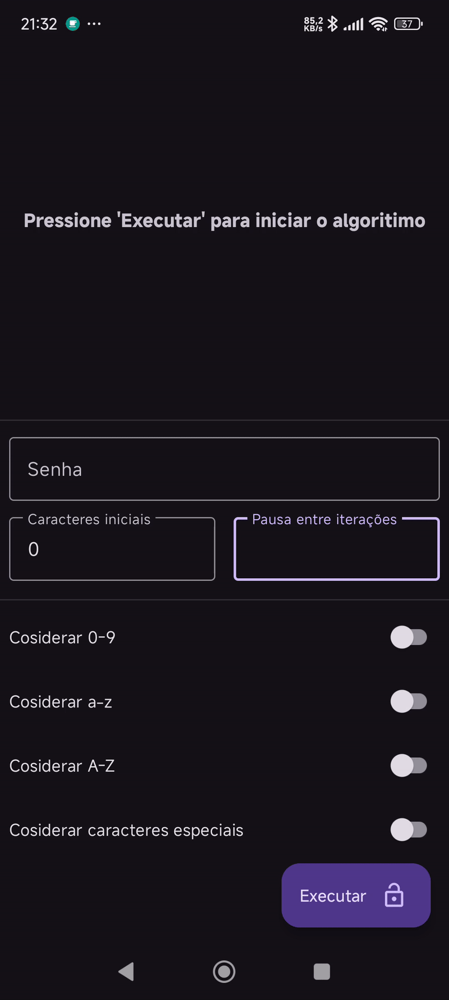

# Algoritmo de Força Bruta e Aplicativo Demonstrativo

Este repositório contém dois componentes principais:
- Um **algoritmo de força bruta**, projetado para demonstrar como é possível encontrar uma senha ao testar todas as combinações possíveis.
- Um **aplicativo Android**, que permite aos usuários visualizar o funcionamento do algoritmo em tempo real.

## O que é um algoritmo de força bruta?
Um algoritmo de força bruta é um método sistemático para resolver problemas testando todas as combinações possíveis até encontrar a solução correta. Em contexto de senhas, esse algoritmo:
1. Começa testando combinações de um caractere.
2. Aumenta gradualmente o número de caracteres, testando todas as possibilidades.
3. Repete o processo até encontrar a combinação que corresponde à senha alvo.

### Exemplo de funcionamento:
Suponha que a senha seja `AB1`. O algoritmo funciona assim:
1. Testa: `A`, `B`, `C`, ..., `Z`.
2. Passa para combinações de dois caracteres: `AA`, `AB`, `AC`, ..., `ZZ`.
3. Finalmente, encontra `AB1` e para a execução.

Esse método não utiliza nenhum tipo de otimização ou conhecimento prévio da senha, garantindo que todas as possibilidades sejam testadas. Embora seja ineficiente para longas senhas, é uma abordagem simples para entender o impacto de uma senha fraca.


### Funcionalidades do aplicativo:
1. **Execução em tempo real:** O aplicativo exibe:
   - A senha atual que o algoritmo está testando.
   - O número total de tentativas realizadas.
   - O tempo decorrido desde o início da execução.
   
2. **Entrada personalizada:** O usuário pode:
   - Inserir uma senha alvo para que o algoritmo tente encontrá-la.
   - Especificar informações adicionais, como:
     - Começar com um número mínimo de caracteres (por exemplo, senhas com no mínimo 8 caracteres).
     - Quais tipos de caracteres usar: letras minúsculas, maiúsculas, números ou caracteres especiais.

3. **Análise automática:** Quando o usuário insere uma senha, o aplicativo automaticamente:
   - Analisa a senha.
   - Marca os switches correspondentes (minúsculas, maiúsculas, números, caracteres especiais).
   - Define o comprimento inicial com base na senha fornecida.

4. **Configuração manual:** O usuário pode desmarcar ou ajustar manualmente as opções de caracteres e comprimento inicial, permitindo que o algoritmo comece sem informações prévias.

### Interface do aplicativo:
- **Entrada de senha:** O usuário insere a senha alvo.
- **Switches de configuração:** Opções para incluir/excluir:
  - Letras minúsculas.
  - Letras maiúsculas.
  - Números.
  - Caracteres especiais.
- **Botão de execução:** Inicia ou interrompe o algoritmo.
- **Exibição de progresso:** Mostra o estado atual do algoritmo, incluindo a senha testada, número de tentativas e tempo decorrido.

### Propsta do app:
O objetivo do aplicativo é ajudar os usuários a entender o impacto de senhas seguras e os desafios de usar força bruta como método de descoberta. Ele permite visualizar o tempo necessário para encontrar uma senha com diferentes combinações de caracteres e comprimentos.

---

## Captura de tela
Adicione aqui uma captura de tela mostrando a interface do aplicativo:



---

## Como testar o app 

1. **Execute o .apk** em \BruteForce\app\build\outputs\apk\debug

## Como executar o projeto

1. **Clone este repositório:**
   ```bash
   git clone https://github.com/seu-usuario/repositorio.git
   ```

2. **Abra o projeto no Android Studio.**
3. **Compile e instale o aplicativo no seu dispositivo ou emulador.**

---

## Licença
Este projeto é disponibilizado sob a licença [Apache License 2.0](LICENSE).
